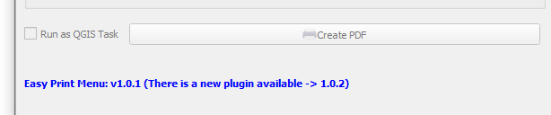
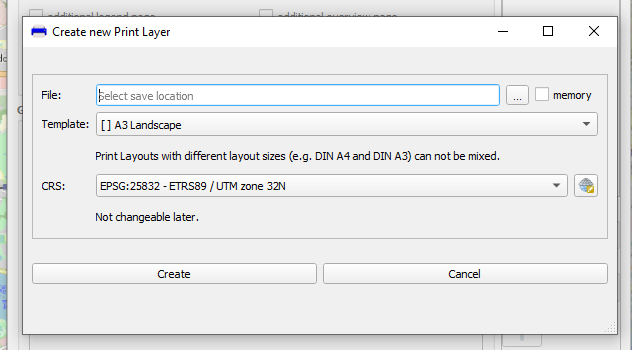
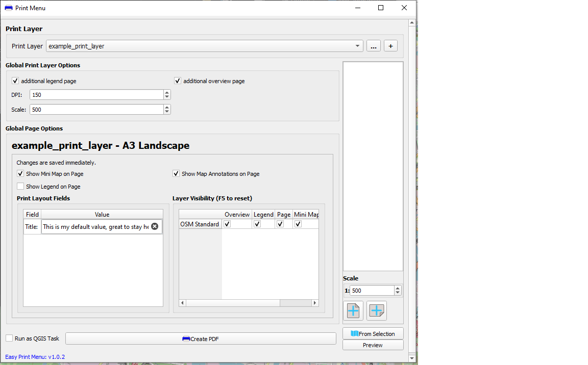
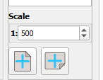
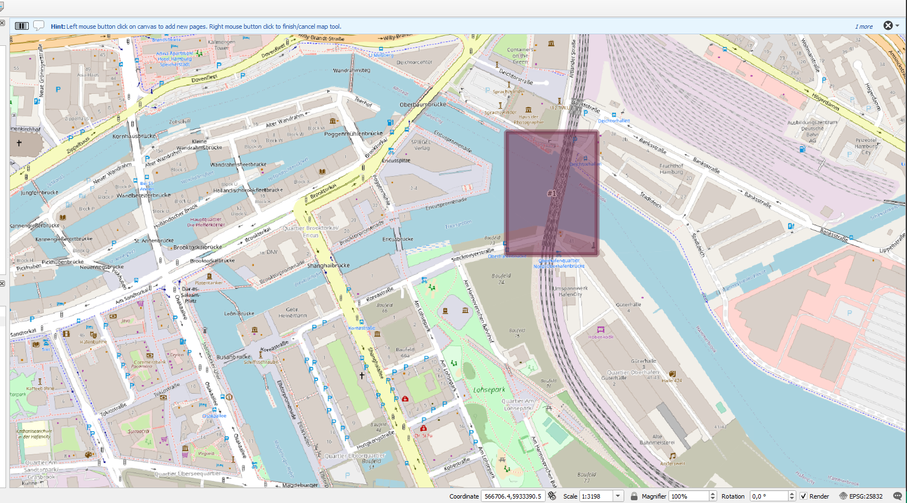
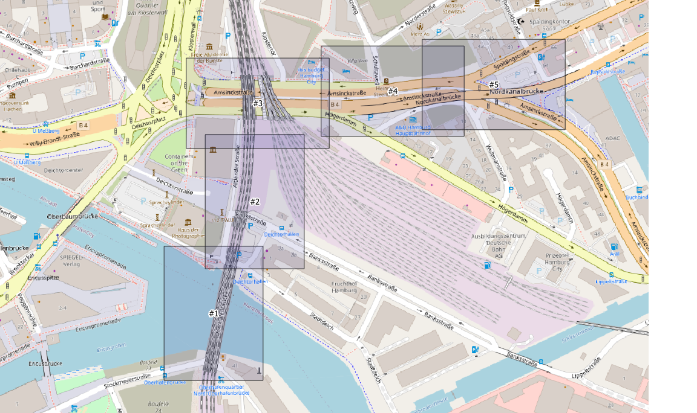
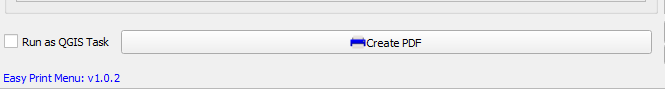

# Manual information

This is a simple manual to use the basic functions from "Easy Print Menu" with the basic print layouts from folder "plots" in plugins directory.

Keep in mind to read some tool tips on buttons, checkboxes etc. to get more information about options and some hints.

## Import information
When you change visibilities in you print layer, then this visibility options will only work in your current opened QGIS project.

## Plugin updates
The plugin will automatically look for a new version on start up.


If there is a new version available, you have to update the plugin on your own via QGIS. This is only a hint for you.

PS: The new version hint will also appears, if you have a newer version that is not available in official QGIS Plugin Repository.

### Clear Network Cache
Maybe the plugin will not recognize a new version. It helps, when you clear the current QGIS Network Cache in the QGIS settings.


# Print some pages

## Open or create a new plot layer

### 1. open the Print Menu


On first load it can take a while depends on how many layouts you have defined.

### 2. Basic Print menu


Per default now print or plot layer is selected.
You can select a loaded print layer, create a new one or load in existing print layer file to your project.

##### Hint
```
When you add an existing file, then maybe the visibility cannot be loaded correctly. Because the visibility depends to the last used QGIS project.
```


### 3. Create a new print layer

To create a new layer, then click on the "add" button with a "plus" (+) symbol.




You can decide, whether to create the layer temporary (will be temporary saved in your QGIS profile folder) or in an other location on your file system.

You can choose a template and you have to be sure, you are using the coordinate reference system you need.

Keep the hints in mind!

A set CRS cannot be changed later.
When your choosed CRS is different to current QGIS project projection, then the plot pages maybe looks a bit special (wrong orientation, angled, etc.)


### 4. Change Options

You can change some options, e.g. DPI, default scale and more.

The known options from a QGIS export are not available, because the dialog is not available in the PyQGIS API (https://qgis.org/api/classQgsLayoutPdfExportOptionsDialog.html#details)

The Global Page options are only valid for new pages. Already created pages will not be updated to this options (e.g. "Show Legend on Page")




Based on you layout you can add some information.
E.g. `This is my default value, great to stay here :)`. This will be used per default on each page.

You can change the global layer visibility too -> table with many check boxes.


### 5. Add Pages
Now let add some pages, maybe you already found the buttons.



These buttons are visible in QGIS toolbar too.

Depends on you used template, you can add a landscape or portrait page.
When you have multiple landscape templates in same page size, then you have to select your template for new pages in a dropdown.


<br>
When you clicked on the button to add a new page, the Print Menu will be set to background an you can add new pages on the map by clicking the left mouse button. Right click will cancel/finish the current tool.



<br>
When you have added some pages, it can be look like this




You can double click on a page and change some option. The window is similar to the global options.
When you want to use different field values per page, you have to activate the field check box.


### 6. Create PDF

Optional: You can run the print task as QGIS task, but maybe QGIS will say `Oops, somthing went wrong :(`

Click on "Create PDF" and choose you save location and filename.




[Open PDF Example](./project/example_print_layer.pdf)